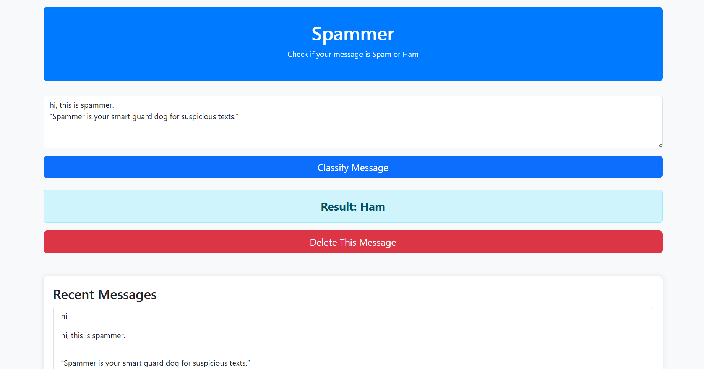
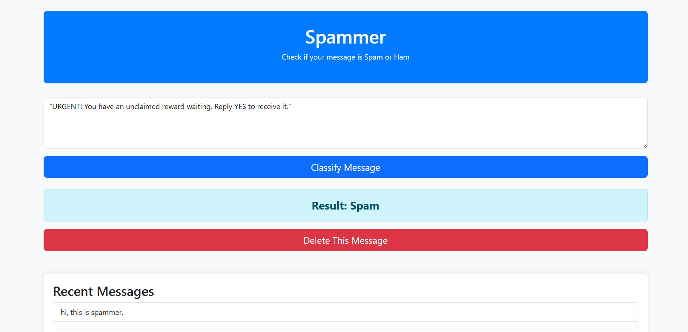
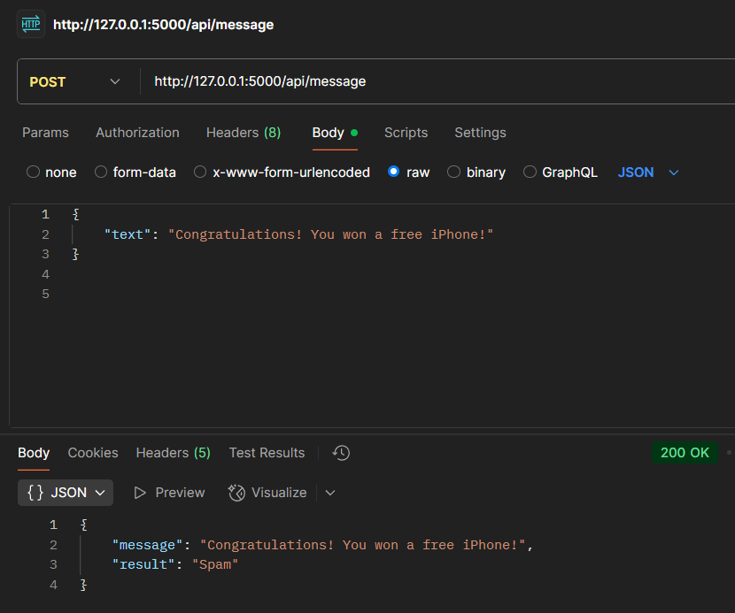
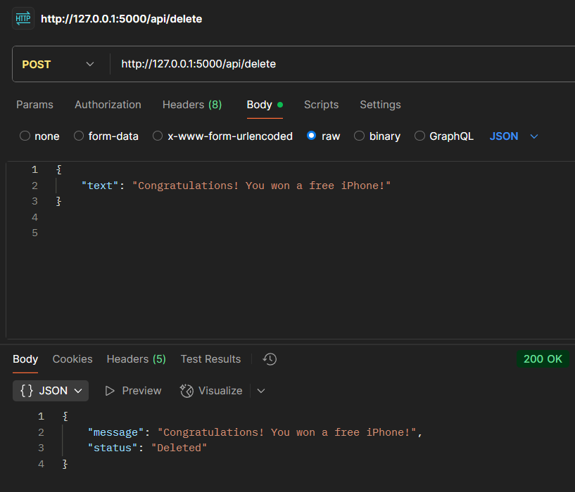

# Spammer

Spammer is a machine learning web app for real-time spam message detection. Built with Python, Flask, and scikit-learn, it classifies messages as **Spam** or **Ham** and offers both a user-friendly web interface and powerful API endpoints for integrations.

---

## 🔥 Key Highlights

- Spam Detection: Machine learning model analyzes and classifies messages instantly.
- Web Interface: Clean, responsive UI for checking individual messages manually.
- API Ready: Seamlessly integrates with tools like Postman for automated testing and potential mobile or external app connections.
- Message Deletion Allows deleting suspicious messages and logging them for records.

---

## ⚙️ Workflow

Here’s how Spammer works:

1. User Inputs Message
   - Via the web interface
   - Or via an external request through the API (e.g. Postman)

2. Preprocessing
   - Message is cleaned (lowercasing, removing punctuation, etc.)

3. Prediction
   - The trained machine learning model predicts if it’s Spam or Ham.

4. Result Display
   - Web UI shows the result instantly.
   - Or, the API returns a JSON response.

5. Deletion Option
   - For spam messages, the user can choose to delete it.
   - Deleted messages are saved in a log file for future review.

---

## 🤝 Why Postman Matters

While the web UI is perfect for manual use, Postman allows:

- Automated API testing.
- Simulation of real integrations with other apps or services.
- Rapid debugging and experimentation.
- Scalability into mobile or third-party systems.

Using Postman turns Spammer from a simple local app into a powerful backend service ready for real-world integrations.

---

## 💡 Why Spammer Is More Than “Just Flask”

Many Flask apps only handle web pages for human users. Spammer is different because:

- It’s both a web app and a backend service.
- It exposes **REST API endpoints** for automated tools like Postman or future mobile apps.
- It’s designed for **integration and scalability**, not just local use.
- It shows how a machine learning model can power both a user interface and external systems.

This makes Spammer a great showcase of **real-world ML deployment**, beyond just Flask web pages.

---

## 💻 Screenshots

**Web Interface**  

**API Testing in Postman**  

---

## ✨ About

Spammer was developed as part of my journey to learn deploying machine learning models into real applications, designing user-friendly interfaces, and creating robust APIs for integrations.

👤 **Rasal Harish**

[GitHub Profile](https://github.com/Rasalharish) • [LinkedIn](https://www.linkedin.com/in/rasalharish/)
